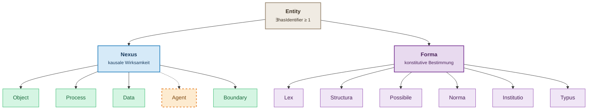

# MIN Ontology

MIN (Material · Information · Nexus) is a foundational ontology for modeling
industrial and scientific domains with a strict distinction between:

- **Nexus**: actual entities that are causally effective
- **Forma**: formal entities that are constitutively determining

The current stable release line is **v3.x** (current: **v3.3.0**, tag `v3.3.0`).

## Canonical IRIs

- Ontology IRI: `https://w3id.org/min`
- Namespace: `https://w3id.org/min#`
- Current version IRI: `https://w3id.org/min/3.3.0`

## Conceptual core (v3.3.0)

MIN v3 defines **14 classes**:

- Root: `min:Entity`
- Actual branch: `min:Nexus`, `min:Object`, `min:Process`, `min:Data`, `min:Agent`, `min:Boundary`
- Formal branch: `min:Forma`, `min:Lex`, `min:Structura`, `min:Possibile`, `min:Norma`, `min:Institutio`, `min:Typus`

For full class definitions, see `docs/class-catalog.md`.



**Legende:**  
`━━` rdfs:subClassOf (disjunkt) · `╌╌` rdfs:subClassOf (überlappt — Agent)  
⊥ Object · Process · Data · Boundary paarweise disjunkt · Agent überlappt  
⊥ Lex · Structura · Possibile · Norma · Institutio · Typus paarweise disjunkt  
Entity ≡ Nexus ⊔ Forma

[min_hierarchy.svg](docs/min_hierarchy.svg)

## Repository structure

- `min.ttl`: current MIN ontology
- `min-v*.ttl`: immutable release snapshots
- `min-v3.3.0.ttl`: current immutable snapshot (hyphen naming)
- `min_v3.3.0.ttl`: current compatibility snapshot (underscore naming)
- `examples/`: example instance graphs
- `examples/min-v3.3.0-examples.ttl`: integrated v3.3.0 scenario
- `queries/competency/`: competency queries
- `shapes/`: SHACL shapes
- `tests/sparql/`: SPARQL ASK regression checks
- `scripts/validate.py`: local/CI validation runner
- `docs/`: MkDocs documentation source

## Quickstart

Requirements:

- Python `3.12`
- `uv` (recommended) or `pip`

Validate ontology quality:

```bash
uv run ontology-validate
```

Fallback:

```bash
python3 -m pip install -r requirements-dev.txt
python3 scripts/validate.py
```

## Documentation

Local docs build:

```bash
uv run mkdocs build --strict
```

Local live preview:

```bash
uv run mkdocs serve
```

Published docs:

- `https://lepy.github.io/min-ontology/`

Core doc pages:

- `docs/min-model.md`
- `docs/class-catalog.md` (all classes in MIN v3)
- `docs/property-catalog.md`

Static visualizations are intentionally kept as part of the docs:

- `docs/min-v3_0_0-visualization.html`
- `docs/min-v2_1_0-visualization.html`
- `docs/bfo-vs-min3_2_0.html` (historical comparison page)

## GitHub Pages deployment

Docs deployment is automated via `.github/workflows/docs.yml` on each push to
`main` and can also be triggered manually (`workflow_dispatch`).

Repository setting required:

- `Settings -> Pages -> Build and deployment -> Source: GitHub Actions`

## Release and versioning policy

- Semantic versioning is used for MIN releases.
- `min-vX.Y.Z.ttl` files are immutable snapshots.
- `min_vX.Y.Z.ttl` files may exist for compatibility with underscore naming.
- `min.ttl` always points to the latest stable MIN release.
- Since `v2.0.0`, OPA is absorbed into MIN and no separate `opa.ttl` is maintained.

## License and Attribution

- License: [Creative Commons Attribution 4.0 International (CC BY 4.0)](https://creativecommons.org/licenses/by/4.0/)
- Required attribution (Namensnennung): **Dr. Ingolf Lepenies** as author of MIN.
- Suggested citation:
  `"MIN Ontology" by Dr. Ingolf Lepenies, https://w3id.org/min, licensed under CC BY 4.0.`
