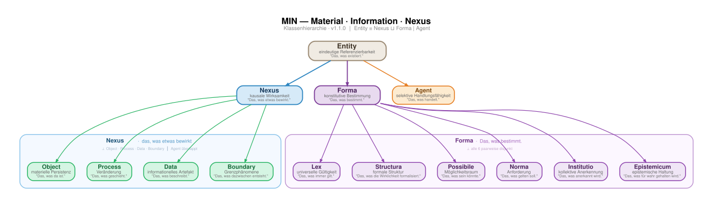

# MIN Ontology

[](https://creativecommons.org/licenses/by-sa/4.0/)
[](https://w3id.org/min/1.1.0)
[](https://w3id.org/min)
[](https://lepy.github.io/min-ontology/)

MIN (Material · Information · Nexus) is a foundational ontology for modeling
industrial and scientific domains with a strict distinction between:

- **Entity · eindeutige Referenzierbarkeit · "Das, was existiert."**
- **Nexus · kausale Wirksamkeit · "Das, was etwas bewirkt."**
- **Forma · konstitutive Bestimmung · "Das, was bestimmt."**
- **Agent · selektive Handlungsfähigkeit · "Das, was handelt."**

The current stable release line is **v1.x** (current: **v1.1.0**).

Documentation site: <https://lepy.github.io/min-ontology/>

## Canonical IRIs

- Ontology IRI: `https://w3id.org/min`
- Namespace: `https://w3id.org/min#`
- Current version IRI: `https://w3id.org/min/1.1.0`

## Conceptual core

MIN v1.1 defines **16 classes** (14 domain + 2 enums):

- Root: `min:Entity`
- Actual branch: `min:Nexus`, `min:Object`, `min:Process`, `min:Data`, `min:Boundary`
- Formal branch: `min:Forma`, `min:Lex`, `min:Structura`, `min:Possibile`, `min:Norma`, `min:Institutio`, `min:Epistemicum`
- Agent: `min:Agent` ("Das, was handelt.")
- Enums: `min:CausalityMode` (3), `min:EfficacyMode` (10), `min:EpistemicStatus` (5), `min:ConfidenceType` (4)

Canonical subclass profiles:

- `Object · materielle Persistenz · "Das, was da ist."`
- `Process · Veränderung · "Das, was geschieht."`
- `Data · informationelles Artefakt · "Das, was beschreibt."`
- `Boundary · Grenzphänomene · "Das, was dazwischen entsteht."`
- `Lex · universelle Gültigkeit · "Das, was immer gilt."`
- `Structura · formale Struktur · "Das, was die Wirklichkeit formalisiert."`
- `Possibile · Möglichkeitsraum · "Das, was sein könnte."`
- `Norma · Anforderung · "Das, was gelten soll."`
- `Institutio · kollektive Anerkennung · "Das, was anerkannt wird."`
- `Epistemicum · epistemische Haltung · "Das, was fuer wahr gehalten wird."`

For full class definitions, see `docs/class-catalog.md`.



## Repository structure

- `min.ttl`: current MIN ontology (axioms only, < 20 KB)
- `min-docs.ttl`: annotations, philosophical basis, design rationale (imports `min.ttl`)
- `alignment/`: optional alignment modules (BFO, DOLCE, OWL-Time, PROV-O, QUDT, SSN/SOSA, schema.org, DC/FOAF/ADMS)
- `min-v*.ttl`: immutable release snapshots
- `min-v1.1.0.ttl`: current immutable snapshot
- `examples/`: example instance graphs
- `examples/epistemic-zugversuch.ttl`: tensile test with epistemic dimension (v1.1.0)
- `examples/dpp-coil.ttl`: end-to-end DPP use case
- `queries/competency/`: competency queries
- `shapes/`: SHACL shapes
- `tests/sparql/`: SPARQL ASK regression checks
- `scripts/validate.py`: local/CI validation runner
- `docs/`: MkDocs documentation source

## Quickstart

Requirements:

- Python `3.12`
- `uv` (recommended) or `pip`

Validate ontology quality:

```bash
uv run ontology-validate
```

Fallback:

```bash
python3 -m pip install -r requirements-dev.txt
python3 scripts/validate.py
```

## Documentation

Local docs build:

```bash
uv run mkdocs build --strict
```

Local live preview:

```bash
uv run mkdocs serve
```

Regenerate class hierarchy artifacts (`.dot`, `.mmd`, `.svg`) from `min.ttl`:

```bash
uv run python scripts/generate_hierarchy.py
```

Published docs:

- `https://lepy.github.io/min-ontology/`

Core doc pages:

- `docs/min-model.md`
- `docs/class-catalog.md`
- `docs/property-catalog.md`
- `docs/epistemic-dimension-en.md` / `docs/epistemic-dimension-de.md` (v1.1.0 design decisions, bilingual)
- `docs/migration-v1.0-to-v1.1.md`

## GitHub Pages deployment

Docs deployment is automated via `.github/workflows/docs.yml` on each push to
`main` and can also be triggered manually (`workflow_dispatch`).

Repository setting required:

- `Settings -> Pages -> Build and deployment -> Source: GitHub Actions`

## Release and versioning policy

- Semantic versioning is used for MIN releases.
- `min-vX.Y.Z.ttl` files are immutable snapshots.
- `min.ttl` always points to the latest stable MIN release.

## Related projects

- **[sdata-ontology](https://github.com/lepy/sdata-ontology)** — Domain ontology suite for Product Passports, Circular Economy, and Digital Twins, built on MIN.
- **[sdata-experiments](https://github.com/lepy/sdata-experiments)** — Tensile/compression/bending/fatigue test workflows using the MIN/sdata stack.

## Alignments to external ontologies

MIN provides optional alignment modules in `alignment/`:

| Module | Target | Key mappings |
|---|---|---|
| `min-bfo.ttl` | BFO 2020 | Object → material entity, Process → process |
| `min-dolce.ttl` | DOLCE Ultra Lite | Entity, Process, Data, Agent, Forma |
| `min-prov.ttl` | W3C PROV-O | Process → Activity, performs → wasAssociatedWith |
| `min-time.ttl` | W3C OWL-Time | Process → ProperInterval |
| `min-qudt.ttl` | QUDT | QuantityValue → Data, Quantity → Forma |
| `min-sosa.ttl` | W3C SSN/SOSA | Process → Procedure, Data → Result |
| `min-schema.ttl` | schema.org | Object → Thing, Process → Action |
| `min-dcterms.ttl` | DC/FOAF/ADMS | Data → BibliographicResource |

## Citation

```bibtex
@misc{lepenies2026min,
  author       = {Lepenies, Ingolf},
  title        = {{MIN} --- {Material} · {Information} · {Nexus}: A Foundational Ontology for Engineers},
  year         = {2026},
  url          = {https://w3id.org/min},
  note         = {Version 1.1.0. Licensed under CC BY-SA 4.0}
}
```

## License and Attribution

- License: [Creative Commons Attribution-ShareAlike 4.0 International (CC BY-SA 4.0)](https://creativecommons.org/licenses/by-sa/4.0/)
- Required attribution (Namensnennung): **Dr. Ingolf Lepenies** as author of MIN.
- Suggested citation:
  `"MIN Ontology" by Dr. Ingolf Lepenies, https://w3id.org/min, licensed under CC BY-SA 4.0.`
