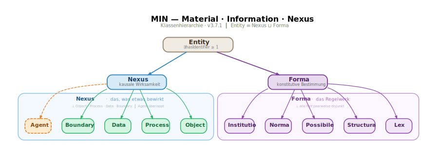

# Ontological breakfast egg

**How do you model an everyday process with a foundational ontology?**

> This guide uses the example of boiling an egg to show how the MIN ontology
> works. Each step introduces one MIN category and explains why exactly
> that category is the right one.

---

## Overview

MIN has two branches under `Entity`:

- **Nexus** — that which causes effects (Object, Process, Data, Agent, Boundary)
- **Forma** — the rulebook by which Nexus operates (Lex, Structura, Possibile, Norma, Institutio)

Boiling an egg requires both. The egg, the pot, the water —
these are Nexus instances. The cooking time specification, the natural law of
heat transfer, the doneness level "soft-boiled" — these are Forma instances.



---

## Step 1 — The things on the table: Object

> *"Does it cause effects as a physical thing?"* → **Object.**

Everything sitting on the stove that is physically there: pot, water, egg, stove.
Object is the material-dominant Nexus. Identity criterion: material
continuity — the egg remains the same egg, even as it changes.

```turtle
@prefix egg: <https://example.org/egg#> .
@prefix min: <https://w3id.org/min#> .

egg:Pot a min:Object ;
    min:hasIdentifier "OBJ-POT-001" ;
    min:hasName "Cooking pot"@en ;
    egg:material "Stainless steel" ;
    egg:volume_ml "2000"^^xsd:float .

egg:Water a min:Object ;
    min:hasIdentifier "OBJ-WATER-001" ;
    min:hasName "Cooking water"@en ;
    egg:amount_ml "1500"^^xsd:float .

egg:Egg_raw a min:Object ;
    min:hasIdentifier "OBJ-EGG-RAW-001" ;
    min:hasName "Raw egg"@en ;
    egg:weight_g "58"^^xsd:float ;
    egg:start_temperature_C "7"^^xsd:float .
```

**Why Object and not Agent?** The pot doesn't act. The water
doesn't act. The egg doesn't act. They are physically present and get
transformed by Processes — but they control nothing.

---

## Step 2 — The cook and the stove: Agent

> *"Does it act selectively and accountably?"* → **Agent.**

The cook is an Agent — they decide when to place the egg, how long
to cook, whether to quench. The stove in operation is also an Agent —
it regulates energy supply selectively.

Agent is orthogonal to Object: a human is Agent ∩ Object (dual-typing).

```turtle
egg:Cook a min:Agent , min:Object ;
    min:hasIdentifier "AGT-COOK-001" ;
    min:hasName "Cook"@en ;
    min:performs egg:EggBoiling ;
    min:controls egg:EggBoiling .

egg:Stove_active a min:Agent , min:Object ;
    min:hasIdentifier "AGT-STOVE-001" ;
    min:hasName "Stove (active)"@en ;
    min:performs egg:Heating .
```

**Why `a min:Agent, min:Object`?** Because the cook is physically present
(Object) AND acts (Agent). MIN doesn't force a choice — Agent is
not disjoint with Object. This is a deliberate architectural decision:
agency is a dimension, not a substance category.

**Why isn't gravity an Agent?** It acts universally, not
selectively. Universality disqualifies for agency — but qualifies
for Lex (→ Step 7).

---

## Step 3 — What happens: Process

> *"Does it transform inputs into outputs over time?"* → **Process.**

Egg boiling is a Process with sub-processes. Process is the
balanced Nexus — both poles (material, informational) carry equal
weight.

```turtle
egg:EggBoiling a min:Process ;
    min:hasIdentifier "PRC-BOIL-001" ;
    min:hasName "Egg boiling"@en ;
    min:hasInput egg:Egg_raw ;
    min:hasInput egg:Water ;
    min:hasOutput egg:Egg_boiled ;
    min:performedBy egg:Cook ;
    min:hasComponent egg:Heating ;
    min:hasComponent egg:Simmering ;
    min:hasComponent egg:Quenching .

egg:Heating a min:Process ;
    min:hasIdentifier "PRC-HEAT-001" ;
    min:hasName "Heating water"@en ;
    min:hasInput egg:Water ;
    min:hasOutput egg:Water ;
    min:performedBy egg:Stove_active .

egg:Simmering a min:Process ;
    min:hasIdentifier "PRC-SIM-001" ;
    min:hasName "Simmering"@en ;
    min:hasInput egg:Egg_raw ;
    min:hasOutput egg:Egg_boiled .

egg:Quenching a min:Process ;
    min:hasIdentifier "PRC-QUENCH-001" ;
    min:hasName "Quenching"@en ;
    min:hasInput egg:Egg_boiled ;
    min:hasOutput egg:Egg_boiled .
```

**Two modes of transformation:**

- **Transformative** (`hasInput`/`hasOutput`): Egg_raw → Simmering → Egg_boiled.
  Two different entities, two IDs. The raw egg is gone.
- **Conservative** (`undergoes`): Heating warms the water, but it
  remains the same water.

The distinction lies in the relation, not in the category.

**Why does `hasInput` range over Nexus, not Object?** Because MIN thinks
causally, not materialistically. A simulation process consumes Data
as input. Hence: `min:hasInput` → `rdfs:range min:Nexus`.

---

## Step 4 — What arises in between: Boundary

> *"Remove one partner — does the phenomenon still exist? No?"* → **Boundary.**

The heat transfer between water and eggshell belongs to neither the water
nor the egg. It only arises *between* them. Remove the egg from the
water — the heat transfer coefficient vanishes.

```turtle
egg:HeatTransfer_Water_Egg a min:Boundary ;
    min:hasIdentifier "BND-WE-001" ;
    min:hasName "Heat transfer water–egg"@en ;
    min:bounds egg:Water ;
    min:bounds egg:Egg_raw ;
    egg:heat_transfer_coefficient_W_m2K "3000"^^xsd:float .

egg:HeatTransfer_Pot_Water a min:Boundary ;
    min:hasIdentifier "BND-PW-001" ;
    min:hasName "Heat transfer pot–water"@en ;
    min:bounds egg:Pot ;
    min:bounds egg:Water .
```

**Why not simply a property on the Object?**
`egg:Water egg:heat_transfer_coefficient "3000"` would be physically
wrong. The coefficient is not a property of the water — it depends
on flow, shell surface, and temperature difference.
It is a system property. That is exactly what Boundary captures.

**Why not Object?** The surface of the egg is Object
(remove all partners — the surface remains). But the
heat transfer between water and egg is Boundary (remove
the egg — the transfer vanishes).

---

## Step 5 — What describes: Data

> *"Does it exist as an information carrier — bytes, structure, semantics?"* → **Data.**

The recipe on the kitchen table and the measured cooking time are Data.
They have a physical existence (paper, bytes) and encode Forma
(cooking time specifications, doneness levels).

```turtle
egg:CookingTimeMeasurement a min:Data ;
    min:hasIdentifier "DAT-TIME-001" ;
    min:hasName "Cooking time measurement"@en ;
    min:describes egg:Simmering ;
    min:generatedBy egg:EggBoiling ;
    min:encodes egg:Norma_soft ;
    egg:cooking_time_min "5.5"^^xsd:float .

egg:Recipe a min:Data ;
    min:hasIdentifier "DAT-REC-001" ;
    min:hasName "Cooking recipe"@en ;
    min:describes egg:EggBoiling ;
    min:encodes egg:Norma_soft ;
    min:encodes egg:Norma_hard ;
    min:encodes egg:Type_soft_boiled .
```

**The key relation: `min:encodes`.**
The recipe (Data) encodes the cooking time specification (Norma). If you
throw away the recipe, the specification remains — every cook knows it by heart.
Data IS NOT Forma. Data ENCODES Forma.

---

## Step 6 — From here on: Forma

Everything so far was Nexus — the actual, the causally effective. Now comes
Forma: the rulebook by which Nexus operates. Forma causes nothing.
But without Forma, every effect would be different.

```
Nexus = the sentences  →  Pot, Water, Egg, Cook, Boiling
Forma = the grammar    →  Heat law, Cooking times, Doneness levels
```

---

## Step 7 — What holds universally: Lex

> *"Does it hold universally, without exception?"* → **Lex.**

Heat transfer and protein denaturation are natural laws.
They determine HOW the simmering proceeds. No cook can change them.

```turtle
egg:HeatTransferLaw a min:Lex ;
    min:hasIdentifier "LEX-HEAT-001" ;
    min:hasName "Heat transfer law"@en ;
    min:governs egg:Simmering ;
    min:constrains egg:HeatTransfer_Water_Egg .

egg:ProteinDenaturation a min:Lex ;
    min:hasIdentifier "LEX-DENAT-001" ;
    min:hasName "Protein denaturation"@en ;
    min:governs egg:Simmering .
```

**`min:governs`** is the specialised bridge relation: Lex → Process.
The natural law determines HOW the process proceeds.

**Why isn't protein denaturation an Agent?** It acts universally —
every protein denatures under heat. Universality disqualifies for
agency (selective, accountable). But it qualifies for Lex.

---

## Step 8 — What gives form: Structura

> *"Is it a purely mathematical structure?"* → **Structura.**

The heat equation in spherical coordinates formalises how
the temperature inside the egg distributes over time. It doesn't exist
physically — but it determines the geometry of the possible.

```turtle
egg:HeatEquation a min:Structura ;
    min:hasIdentifier "STRUCT-HE-001" ;
    min:hasName "Heat equation (sphere)"@en ;
    min:formalizes egg:Simmering .
```

**Why not Data?** The FEM implementation of the equation would be Data
(has bytes, storage location, version). The equation *itself* — ∂T/∂t = α·∇²T —
is Structura. The implementation *encodes* the structure: `Data encodes Structura`.

---

## Step 9 — What ought to hold: Norma

> *"Does it define a target value against which something can be evaluated?"* → **Norma.**

The cooking time specifications are norms. They cause nothing — but they
define the difference between "soft" and "too hard".

```turtle
egg:Norma_soft a min:Norma ;
    min:hasIdentifier "NORMA-SOFT-001" ;
    min:hasName "Cooking time soft-boiled"@en ;
    min:evaluates egg:Egg_boiled ;
    egg:cooking_time_min_min "4"^^xsd:float ;
    egg:cooking_time_max_min "5"^^xsd:float .

egg:Norma_medium a min:Norma ;
    min:hasIdentifier "NORMA-MED-001" ;
    min:hasName "Cooking time medium-boiled"@en ;
    min:evaluates egg:Egg_boiled ;
    egg:cooking_time_min_min "6"^^xsd:float ;
    egg:cooking_time_max_min "7"^^xsd:float .

egg:Norma_hard a min:Norma ;
    min:hasIdentifier "NORMA-HARD-001" ;
    min:hasName "Cooking time hard-boiled"@en ;
    min:evaluates egg:Egg_boiled ;
    egg:cooking_time_min_min "9"^^xsd:float ;
    egg:cooking_time_max_min "11"^^xsd:float .
```

**`min:evaluates`**: Norma → Nexus. The cooking time specification *evaluates*
the boiled egg: pass or fail.

**Why is Norma not Lex?** Lex cannot be violated —
protein denaturation always happens. Norma can be violated —
you can cook for 15 minutes and still get an egg, just not a good one.
That is precisely what makes Norma a Norma.

---

## Step 10 — What makes something what it is: Typus

> *"What kind of egg is this?"* → **Typus.**

The doneness level "soft-boiled" is a Typus — the bundle of determinations
that defines what the egg counts as. Typus bundles Norma, Lex, Structura,
and properties into an essential determination.

```turtle
egg:Type_soft_boiled a min:Typus ;
    min:hasIdentifier "TYP-SOFT-001" ;
    min:hasName "soft-boiled"@en ;
    min:typifies egg:Egg_boiled .

egg:Type_medium_boiled a min:Typus ;
    min:hasIdentifier "TYP-MED-001" ;
    min:hasName "medium-boiled"@en ;
    min:typifies egg:Egg_boiled .

egg:Type_hard_boiled a min:Typus ;
    min:hasIdentifier "TYP-HARD-001" ;
    min:hasName "hard-boiled"@en ;
    min:typifies egg:Egg_boiled .

egg:Type_Chicken_M a min:Typus ;
    min:hasIdentifier "TYP-EGG-M-001" ;
    min:hasName "Chicken egg size M"@en ;
    min:typifies egg:Egg_raw .
```

**`min:typifies`**: Typus → Nexus. The Typus *determines* what the
Nexus counts as. Not describe (→ Data), not evaluate (→ Norma),
but DETERMINE.

**Why is "soft-boiled" not Norma?** Norma evaluates: "The cooking time
SHOULD be 4–5 minutes." Typus constitutes: "A soft-boiled egg IS that
which has firm white and runny yolk." Norma asks: Pass?
Typus asks: What is it?

**Polyhierarchy:** An egg can have multiple types — it is simultaneously
`Type_Chicken_M` (egg variety) and `Type_soft_boiled` (doneness level).

---

## Step 11 — What could go wrong: Possibile

> *"Could it happen, but hasn't happened?"* → **Possibile.**

The water could boil over. A green ring could form around the yolk.
Modal statements about the non-actual.

```turtle
egg:BoilingOver a min:Possibile ;
    min:hasIdentifier "POSS-OVER-001" ;
    min:hasName "Boiling over"@en ;
    min:concerns egg:Heating .

egg:GreenRing a min:Possibile ;
    min:hasIdentifier "POSS-GREEN-001" ;
    min:hasName "Green ring around yolk"@en ;
    min:concerns egg:Egg_boiled .
```

**Why not Process?** A Process HAPPENS. A Possibile does
NOT happen — it COULD happen. If the water actually boils over,
it becomes a Process (`min:realizes`).

---

## Step 12 — What is recognised: Institutio

> *"Does it exist only because agents recognise it?"* → **Institutio.**

The EU marketing standard for eggs (size classes S/M/L/XL) exists
because EU member states recognise it. Without recognition — no standard.

```turtle
egg:EU_MarketingStandard a min:Institutio ;
    min:hasIdentifier "INST-EU-EGG-001" ;
    min:hasName "EU marketing standards for eggs"@en ;
    min:constitutedBy egg:Cook ;
    min:recognizedBy egg:Cook .
```

**Why not Norma?** Norma is a substantive requirement
("Rm ≥ 270 MPa", "cooking time 4–5 min"). Institutio is a social
construct — it exists through collective recognition. The EU regulation
as *catalogue of requirements* is Norma. The EU regulation as
*socially recognised regulatory framework* is Institutio.

---

## Step 13 — Domain properties: Polarity

MIN distinguishes at schema level between material and
informational properties. This is polarity.

```turtle
egg:material a owl:DatatypeProperty ;
    rdfs:subPropertyOf min:materialProperty ;
    rdfs:domain min:Object ;
    rdfs:range xsd:string .

egg:weight_g a owl:DatatypeProperty ;
    rdfs:subPropertyOf min:materialProperty ;
    rdfs:domain min:Object ;
    rdfs:range xsd:float .

egg:cooking_time_min a owl:DatatypeProperty ;
    rdfs:subPropertyOf min:informationalProperty ;
    rdfs:domain min:Data ;
    rdfs:range xsd:float .

egg:heat_transfer_coefficient_W_m2K a owl:DatatypeProperty ;
    rdfs:subPropertyOf min:materialProperty ;
    rdfs:domain min:Boundary ;
    rdfs:range xsd:float .
```

**Materiality** is declared for properties that capture the physical,
causal aspects (mass, volume, temperature). **Informationality**
for properties that capture the structural, semantic aspects (cooking time
as measurement, file format). The declaration resides in the property,
not in the instance. Instances stay flat.

---

## Summary

```
Nexus (causes effects)             Forma (determines)
──────────────────────             ─────────────────────
Object:   Pot, Water, Egg          Lex:        Heat transfer,
Process:  Boiling, Simmering                   Protein denaturation
Agent:    Cook, Stove (active)     Structura:  Heat equation
Boundary: Heat transfer ×2         Norma:      Cooking times (s/m/h)
Data:     Measurement, Recipe      Typus:      soft/medium/hard
                                   Possibile:  Boiling over, Green ring
                                   Institutio: EU marketing standard
```

**Bridge relations connect the branches:**

| Relation | Example |
|---|---|
| `realizes` | Simmering realises the heat equation |
| `governs` | Protein denaturation governs Simmering |
| `evaluates` | Norma_soft evaluates Egg_boiled |
| `encodes` | Recipe encodes Norma_soft |
| `typifies` | Type_soft_boiled typifies Egg_boiled |
| `formalizes` | Heat equation formalises Simmering |
| `concerns` | GreenRing concerns Egg_boiled |
| `constrains` | Heat transfer law constrains HeatTransfer |

**No metaphysics. Just a delicious breakfast egg.**
