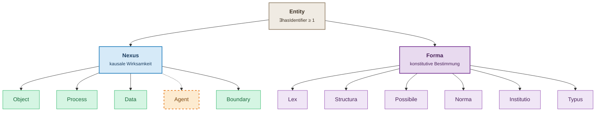

# MIN Model (v3.3.0)

This page summarizes the current conceptual architecture and modeling rules in MIN.

## 1. Core architecture

MIN has an explicit partition under `min:Entity`:

- `min:Nexus`: actual, causally effective entities
- `min:Forma`: formal, constitutively determining entities

Formal axiom:

- `min:Entity owl:equivalentClass [ owl:unionOf ( min:Nexus min:Forma ) ]`

## 2. Why this split matters

The architecture separates artifacts from determinants:

- `min:Data` is an actual artifact (bytes, files, ownership, lifecycle)
- `min:Forma` is not an artifact (law, norm, type, structure, possibility, institution)

Typical pattern:

- Data node stores/communicates knowledge
- Forma node captures what that knowledge is about
- Bridge via `min:encodes`

## 3. Nexus branch (actual)

Classes:

- `min:Nexus` (root)
- `min:Object`
- `min:Process`
- `min:Data`
- `min:Agent`
- `min:Boundary`

Key structural constraints:

- `min:Process` has at least one `hasInput` and one `hasOutput` (range `min:Nexus`)
- `min:Agent` has at least one `performs`
- `min:Boundary` has at least two `bounds`

Disjointness:

- `Object`, `Process`, `Data`, `Boundary` are pairwise disjoint
- `Agent` intentionally overlaps with them (for dual typing)

## 4. Forma branch (formal)

Classes:

- `min:Forma` (root)
- `min:Lex`
- `min:Structura`
- `min:Possibile`
- `min:Norma`
- `min:Institutio`
- `min:Typus`

Disjointness:

- The six Forma subclasses are pairwise disjoint
- `min:Nexus` and `min:Forma` are disjoint

## 5. Bridge relations (Nexus <-> Forma)

General bridge:

- `realizes` / `realizedBy`

Forma-to-Nexus specialization:

- `constrains`
- `governs` (`Lex -> Process`)
- `formalizes` (`Structura -> Nexus`)
- `evaluates` (`Norma -> Nexus`)
- `concerns` and `alternativeTo` (`Possibile -> Nexus`)
- `typifies` / `typifiedBy` (`Typus <-> Nexus`)

Agent-to-institution bridge:

- `constitutes` / `constitutedBy`
- `recognizes` / `recognizedBy`

Data-to-forma bridge:

- `encodes` / `encodedBy`

## 6. Identity semantics for process modeling

MIN distinguishes two modeling modes:

- Transformative: `hasInput` / `hasOutput` represent new entities (new identity)
- Conservative: `undergoes` / `resultOf` represent persistence through change (same identity)

## 7. Property polarity (schema level)

Polarity is modeled on property definitions (not on blank-node wrappers):

- `min:materialProperty`
- `min:informationalProperty`

Domain properties should declare `rdfs:subPropertyOf` one of these two.

## 8. Practical modeling rules

1. If it acts causally, start in the `Nexus` branch.
2. If it determines validity/type/structure/possibility without causal action, use `Forma`.
3. Keep artifacts in `Data` and connect to formal meaning with `encodes`.
4. Use `Typus` for kind-of determination ("what it is"), not `Norma` ("what it should satisfy").
5. Model relational phenomena like friction/contact resistance as `Boundary`, not as single-object properties.

## 9. OWL-DL and inverse completeness

Current model characteristics:

- Polarity super-properties are `owl:AnnotationProperty` (OWL-DL compatible)
- 12 inverse object-property pairs are explicitly declared
- Branch disjointness and class partition are represented as OWL axioms

## 10. Backward compatibility

- Nexus-centric v2-style instance modeling remains valid in v3.x.
- v3 adds explicit formal semantics (`Forma` branch and bridge relations) without removing core Nexus patterns.

